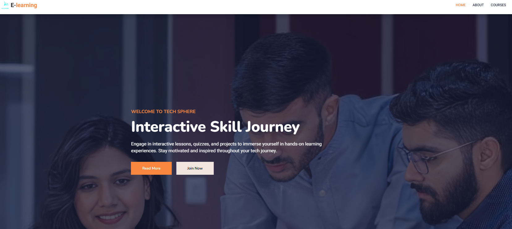
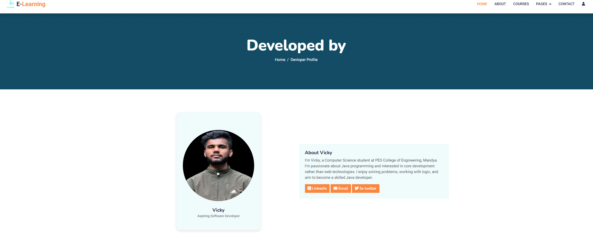
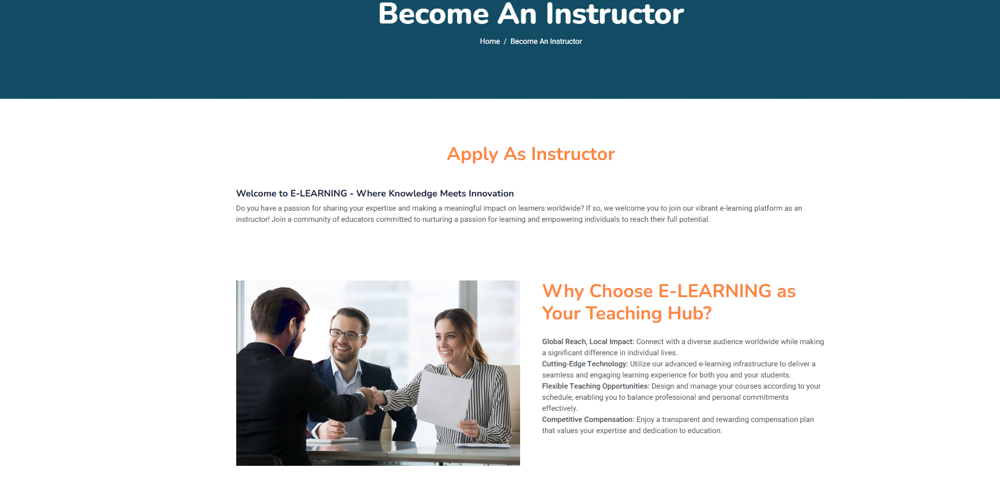

# 📚 E-Learning Website






Welcome to **E-Learning Website**, an interactive and user-friendly platform to enhance your online learning experience. Developed using **HTML5**, **CSS3**, **Bootstrap 5**, and **JavaScript**, this frontend-only solution supports responsive design and basic user authentication via `localStorage`.

---

## 🌟 Features

- ✅ **Responsive Design** – Fully mobile-friendly using Bootstrap 5.
- 🎓 **Course Catalog** – Structured descriptions with images and media.
- 🧑‍🏫 **Instructor Application** – Educators can apply and contribute.
- 🔐 **User Registration & Login** – Frontend-only authentication.
- 💬 **Contact Us Page** – Easy way to connect for queries and support.
- 📊 **(Future)** Admin Dashboard with analytics.
- 🏆 **(Future)** Progress Tracking and Gamification.

---

## 🚀 Getting Started

### 🔧 Prerequisites

- A modern web browser (Chrome, Firefox, Safari)
- A code editor (VS Code)

### 🛠️ Installation

1. **Clone the Repository**:
   ```bash
   git clone https://github.com/VickySource/E-learning.git
2. Navigate to Project Folder:

   cd E-learning

3. Launch the Website:

Open index.html directly in your browser

OR use Live Server in VS Code for better dev experience
🛠️ Technologies Used

Tech	Purpose

HTML5	Page Structure
CSS3	Styling and Layout
Bootstrap 5	Responsive UI Components
JavaScript	Interactivity and Authentication
localStorage	Temporary User Data Storage


---

🤝 Contributing

We welcome all contributions, whether big or small.
Found a bug? Want to request a feature? You’re most welcome!

📩 Get In Touch

📧 Email: vvicky25@gmail.com

💬 GitHub Discussions : https://github.com/VickySource/E-learning/discussions/
 lin

---
🙋 Contributor Info

Name: VICKY S

GitHub: [@VickySource](https://github.com/VickySource)

LinkedIn: [Dhanush A R](https://www.linkedin.com/in/vicky-s1/)

Twitter/X: [@VickySource](https://x.com/vikkitwits)


📌 Future Enhancements

[ ] User progress & badges

[ ] Admin Dashboard with analytics

[ ] Dark mode

[ ] Firebase/Backend integration

[ ] Notifications & messaging


---

💡 Support

If you like this project:

⭐ Star this repo

📣 Share it with friends

🛠️ Suggest ideas and improvements!


---

📜 License

This project is licensed under the MIT License.
You're free to use, modify, and distribute under its terms.


---

🙌 Thanks To

All open-source contributors, teachers, and learners helping build a better learning future.
